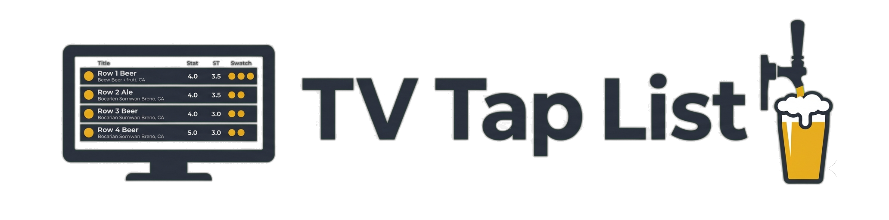
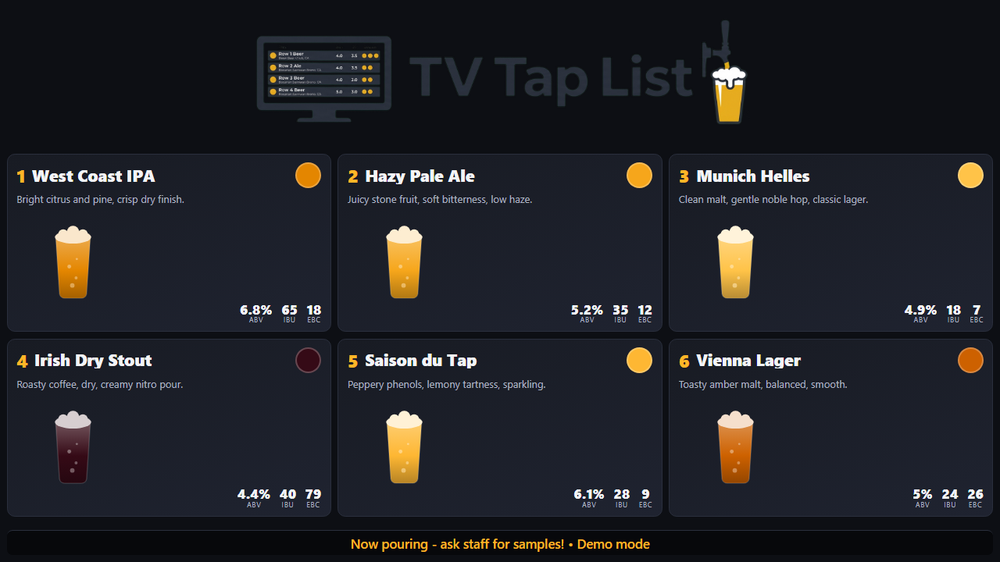

# TV Tap List

<p align="center">
  
</p>

**An offline-first digital beer tap list for TVs.** Point a TV's browser at it and
it shows a clean, full-screen board of what's on tap - name, tasting notes, ABV,
IBU, gravity, and a colour swatch matched to each beer.

It pulls your beers automatically from **[Brewfather](https://brewfather.app)** and
keeps showing the **last known board even when the internet drops** - no spinners,
no blank screen, zero outbound requests. The container is the brain; the TV is just
a screen pointed at it.



- **One container.** Python + FastAPI inside; vanilla HTML/CSS/JS on the TV. No
  cloud, no build step, no CDNs.
- **Offline-first.** Beers are cached as plain text + images in a folder you map
  from the host, so the board survives reboots and outages and stays inspectable.
- **Runs anywhere Docker does** - a Raspberry Pi, an Unraid box, a NUC, a VM.

---

## Try it now (demo)

One command pulls the image and runs a self-contained demo with sample beers - no
Brewfather account, no config:

```bash
docker run -d --name tv-taplist-demo -p 8080:8080 \
  -e DEMO_MODE=true \
  ghcr.io/jceccato/tv-taplist:latest
```

- **Display:** <http://localhost:8080/> - the TV board (no login).
- **Admin:** <http://localhost:8080/admin> - open (no login) in demo mode so you can
  play with settings, themes and overrides. Set `ADMIN_PASSWORD` before exposing the
  box to anyone; a password re-enables normal login.

Stop and remove it when you're done: `docker rm -f tv-taplist-demo`.

> The demo is for evaluation only -- see [INSTALLATION.md](docs/INSTALLATION.md) for a real setup.

---

## Set it up for real

```bash
bash <(curl -fsSL https://raw.githubusercontent.com/jceccato/tv-taplist/main/setup)
```

The guided installer asks a few questions (admin password, timezone, Brewfather
details), installs Docker Compose if needed, writes the config, and starts the
container. Full env var reference, reverse-proxy/HTTPS setup, and the Brewfather API
key walkthrough: [INSTALLATION.md](docs/INSTALLATION.md).

| Path | Best for | Guide |
|------|----------|-------|
| **Guided installer** | Linux / Raspberry Pi / NUC | [INSTALLATION.md -> Guided installer](docs/INSTALLATION.md#guided-installer-recommended) |
| **Unraid** | Unraid servers | [INSTALLATION.md -> Unraid](docs/INSTALLATION.md#unraid) · [UNRAID.md](docs/UNRAID.md) |
| **Manual Docker Compose** | You already run Compose | [INSTALLATION.md -> Manual](docs/INSTALLATION.md#manual-docker-compose) |

---

## Getting beers onto the board

1. In Brewfather, open the batch for a beer that's on tap.
2. Add a line to the batch's **Batch Notes** field: `tap:1` (the tap number it's pouring on).
3. Set the batch **status to Completed**.

On its next sync the board picks it up. You can fine-tune the swatch colour,
glassware and more with extra note tokens or from the admin panel - see
[FAQ.md -> Brewfather](docs/FAQ.md#brewfather-sync). Beers that aren't Completed are
ignored by default, so works-in-progress never show up by accident - though you can
opt to include **Conditioning** batches (lagering / maturing) from the admin.

---

## Display on a screen

Once the container is running, you need a device that loads `/` in a full-screen
browser and keeps it there. Two supported paths:

| Path | Best for | Guide |
|------|----------|-------|
| **Raspberry Pi** | Dedicated, always-on Pi plugged into the TV via HDMI | [RASPBERRY_PI_KIOSK.md](docs/RASPBERRY_PI_KIOSK.md) |
| **Android device** | Phone, tablet, Android TV, Chromecast, Fire Stick — no Pi needed | [ANDROID_KIOSK.md](docs/ANDROID_KIOSK.md) |

Both set up a kiosk that launches the board on boot and stays full-screen with
no user interaction.

---

## How it works

A short tour: the container syncs from Brewfather on a timer, resolves each tap to
a beer, computes its colour, and serves a board the TV polls and updates in place.
Manual overrides let you place beers Brewfather doesn't know about. Everything
persistent is plain text in a folder you can open.

The full explanation - sync, colours and themes, glassware, pagination, the offline
guarantee, archiving, and security - is in **[FAQ.md](docs/FAQ.md)**.

---

## Guides

- **[INSTALLATION.md](docs/INSTALLATION.md)** - set it up: demo, guided installer,
  Unraid, manual Compose, env vars, reverse proxy, Brewfather API key.
- **[FAQ.md](docs/FAQ.md)** - how everything works, in depth.
- **[UNRAID.md](docs/UNRAID.md)** - the deep-dive Unraid walkthrough.
- **[RASPBERRY_PI_KIOSK.md](docs/RASPBERRY_PI_KIOSK.md)** - turn a Raspberry Pi into a
  dedicated kiosk display.
- **[ANDROID_KIOSK.md](docs/ANDROID_KIOSK.md)** - use an Android tablet, TV,
  Chromecast or Fire Stick as a kiosk display.
- **[BUILDING.md](docs/BUILDING.md)** - build from source (development, customisation,
  or architectures without a prebuilt image).

## License

AGPLv3. See [LICENSE](LICENSE). In short: you may use, modify, and redistribute
this software, but if you offer a network-accessible service based on it, you
must also make the source code (including your changes) available to its users.
